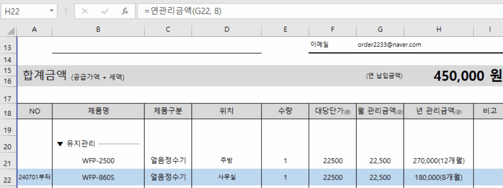
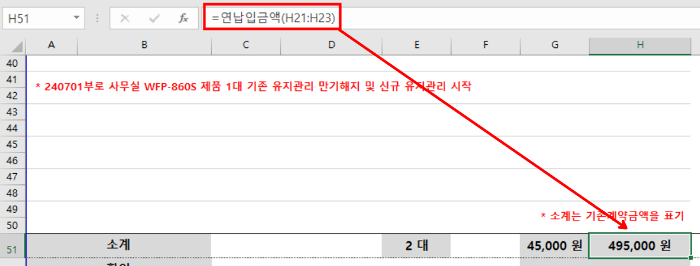

# SUB-PJT-excel-custom-format
엑셀 사용자 함수를 통해 서식 변경 자동화

## Demo
<center>
연관리금액 함수를 통해, 입력값에 따라 서식 변경



연납입금액 함수를 통해, 문자열에서 숫자만 출력해서 더함


</center>

## Tips
### 1. 사용자 함수 만들기 [참고](https://mainia.tistory.com/1180)

1. [개발 도구]탭 > 
[코드] 그룹 > [Visual Basic] 버튼 클릭

2. Function과 End Function으로 구성.

3. 함수명이나 인자를 한글로 설정 가능.

```vbscript
Function 할인후금액(판매금액, 판매수량, 할인율)
    If 판매수량 >= 600 Then
        할인후금액 = 판매금액 - (판매금액 * 할인율)
    Else
        할인후금액 = 판매금액
    End If
End Function
```

### 2. 숫자에 쉼표 넣기 [참고](https://mwultong.blogspot.com/2007/01/excel-vba-3-number-comma-commify.html)

```vbscript
Sub Thousands_Separators_Example()

  n = 1234567
  MsgBox Format(n, "#,#")
  ' 출력 결과: 1,234,567

  n = 1234.333
  MsgBox Format(n, "#,#0.00")
  ' 출력 결과: 1,234.33

End Sub
```

### 3. 문자열 자르기 [참고](https://www.oppadu.com/vba-%EB%AC%B8%EC%9E%90%EC%97%B4-%EC%9E%90%EB%A5%B4%EA%B8%B0/)

```vbscript
' 문자열을 구분기호 기준으로 자름
strings = Split(문자열, 구분기호)

' 앞 부분과 뒷 부분으로 나눠짐
before = strings(0)
after = strings(1)
```

### 4. 문자열을 숫자로 바꾸기 [참고](https://mr-johndoe.tistory.com/entry/VBA-%EB%82%B4%EC%9E%A5-%ED%95%A8%EC%88%98-Val-Str)

```vbscript
' 문자열 180000을 숫자로 바꿈
num = Val("180000")
```

### 5. 셀 범위 반복문 [참고](https://ruahneuma.tistory.com/entry/%EC%97%91%EC%85%80-VBA-%EC%9C%A0%EC%9A%A9%ED%95%9C-%EC%82%AC%EC%9A%A9%EC%9E%90%EC%A0%95%EC%9D%98-%ED%95%A8%EC%88%98)

```vbscript
Function constr(ByRef cRng As Range) As String

  Dim r As Range
  Dim str As String
  For Each r In cRng  ' 입력받은 범위를 순회하면서
    str = str & r.Value ' 각 셀의 값을 누적 (사칙연산 아님)
  Next
  constr = str

End Function
```
